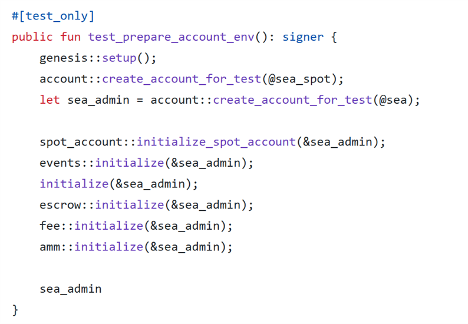
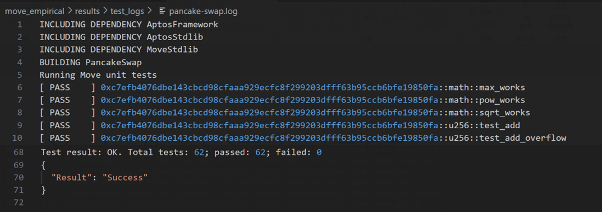
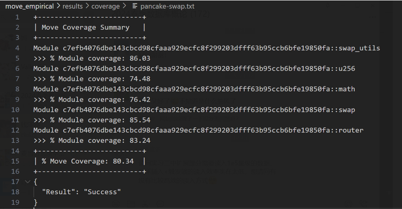
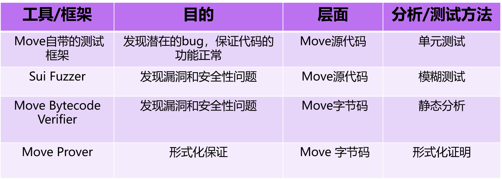
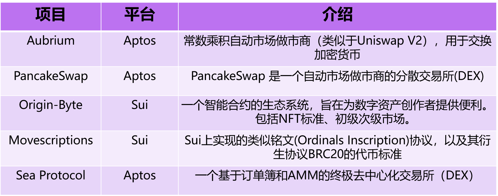
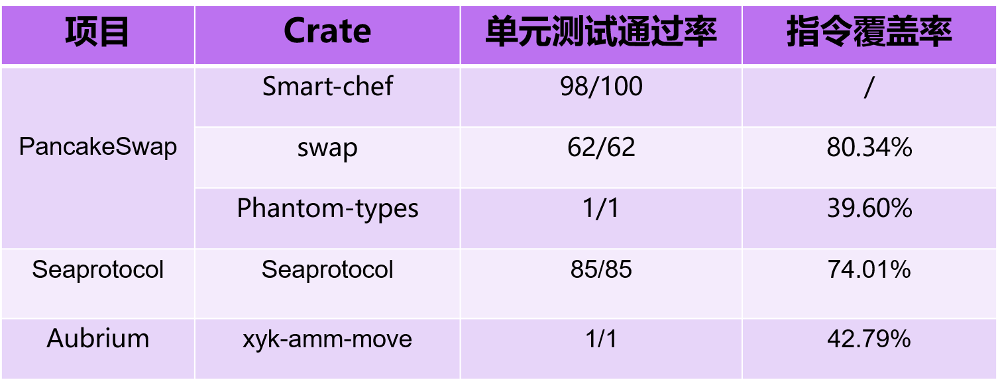
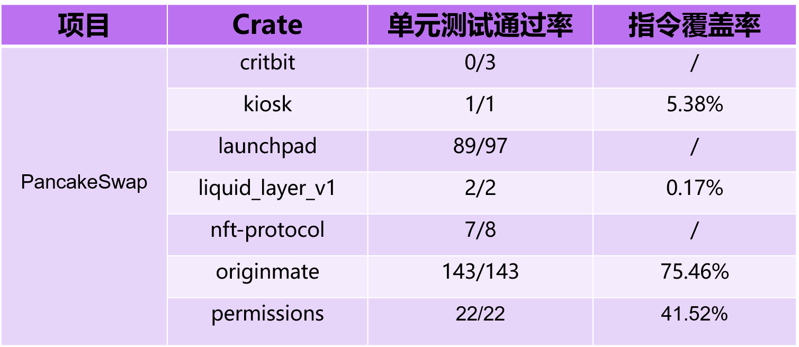
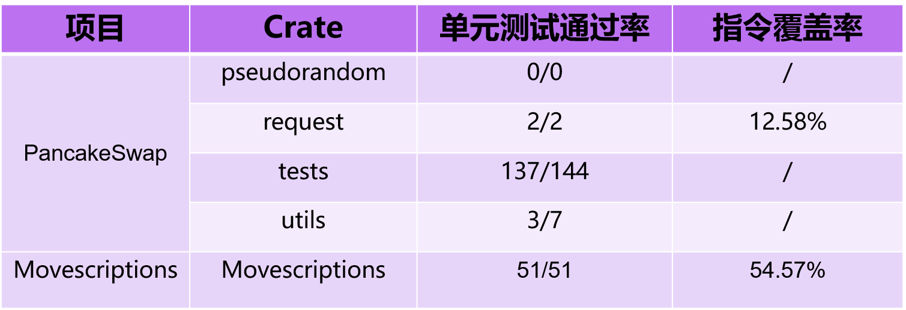

# Move语言分析与测试现状

张昱琪，范居令

**分工:** 
张昱琪：资料收集、调研和分析；
范居令：进行测试实验、收集数据

### 研究背景
- **Move语言：** 
Move是一种用于编写安全智能合约的编程语言，最初由Facebook开发，为Libra区块链作为包容性金融基础设施的愿景提供支持。Move允许开发人员编写可验证的，用于灵活管理和转移资产的程序。Move在语言层面上提供安全性保护，防止这些资产受到攻击。Move受到Rust启发，使用具有Move语义的资源 (resource) 类型作为数字资产（如货币）的显式表示。概括地说，Move的设计理念在于：特殊资源处理、灵活性、安全性和可验证性。

- **Move支持的区块链：**
目前，Move支持的区块链包括Sui, Aptos等。Sui具有高吞吐量、低延迟和由Move编程语言支持的面向资产的编程模型，是第一个互联网规模的可编程区块链平台，展示超出现有系统（传统系统和区块链系统）交易处理能力的能力。Aptos是一个高可扩展性、高安全性、可升级的Layer 1区块链，旨在解决传统区块链面临的低吞吐、高成本、众多安全问题等挑战。

- **Move语言基础知识**
  - **Move模块** 
    Move模块是可以部署在区块链上，并由Move虚拟机执行的程序，与智能合约的概念类似。Move模块是由结构体和函数定义构成的库（library），可以在其中实现各种复杂的功能（如借贷等）。

  - **Move脚本**
    Move脚本也是一种可以由Move虚拟机执行的程序，作为一个入口点（entrypoint）用来调用Move模块里定义的函数。然而它并不会被部署在区块链上，Move脚本在执行过一次后将会被抛弃。

- **Move语言的特点**
  - **特殊资产处理**
  
    资源（resource）是Move语言的核心概念，常被用来表示数字资产。其本质上是一种结构体，被存储在区块链的全局存储中，不能被复制或丢弃。这些性质使资源适合用于定义全局存储模式或表示重要值（如代币等）。
  
  - **灵活性**
  
    Move通过交易脚本增加灵活性，每笔 Libra 交易都包含一个交易脚本，该脚本实际上是交易的主要过程。事务脚本是包含任意 Move 代码的单个过程，它允许可自定义的事务。脚本可以调用区块链中发布的模块的多个过程，并对结果进行本地计算。这意味着脚本可以执行用户自定义的一次性行为（例如向一组特定的收件人付款）或可重用行为（通过调用封装可重用逻辑的单个过程）。

  - **安全性**
  
    Move 必须拒绝不满足关键属性（如资源安全、类型安全和内存安全）的程序，通过字节码验证器（Bytecoe Verifier）检查其资源、类型和内存的安全。
  
  - **可验证性**
  
    没有动态调度。可以静态确定每个呼叫站点的目标。这使得验证工具可以轻松地精确推理过程调用的效果，而无需执行复杂的调用图构造分析。此外，Move 值的每次突变都通过引用发生。可以通过借用检查（Borrow Check）来确保在任何时间点最多存在一个对值的可变引用。此外，该语言确保全局存储始终是一棵树，而不是任意图。这允许验证工具对写入操作的影响进行模块化推理。

### 研究问题
- **RQ1:** 现有的Move分析与测试工具
  - 调查目前流行的Move语言分析工具、测试工具

- **RQ2:** Move模块测试充分性情况
  - 选取一些受欢迎的Move项目，使用上述测试工具对其进行测试，并统计结果

- **RQ3:** 现有Move分析工具、测试框架的不足，未来可能的发展方向

### Move的分析&测试工具
1. Move自带的测试框架

    Move支持单元测试，用于验证非测试代码是否以预期的方式运行。具体来说，可以通过`#[test]`，`#[test_only]` 这两种注释，将模块或模块成员标注为测试用，使用 `#[expected_failure]`将测试注释为“将会发生错误”。被`#[test]`和`#[test_only]`注释的部分只有在测试时才会被编译，不会被部署到链上也不会在链上被执行。测试部分通常先进行一些设置，然后运行想要测试的代码，最后检查结果是否是我们所期望的。
  

2. Move CLI
   
    Move提供的命令行工具Move CLI（Command Line Interface）可以用于执行Move代码中的单元测试。Move CLI 会提供每个测试的执行结果（通过、失败或超时），如果测试用例失败，将报告失败的位置以及导致失败的函数名。除此之外，该工具还可以提供单元测试的指令覆盖率的信息。
  
  

3. Sui Fuzzer
   
    FuzzingLabs 开发的 fuzzer 是一个先进的工具，旨在主动识别 Sui 智能合同中的漏洞和缺陷。这个工具生成单元测试和通过一系列调用促进深入的、有状态（包含全局历史信息）的测试。这种方法允许在各种条件和情景下对智能合同进行更彻底的审查
   
4. 字节码验证器（Bytecode Verifier）
   
    一个静态分析工具，检查Move字节码的资源、类型和内存安全，Move字节码只有通过字节码验证器的验证后才能被部署到链上。具体来说，它检测了：过程和结构声明的特性（例如，资源的线性性）；存在依赖模块和过程目标（即静态链接）模块依赖关系是非循环的；每个基本块的开头和结尾的操作数堆栈高度相同；过程只能通过传递给被调用方的引用来接触属于调用方的堆栈位置；全局和本地内存始终是树形的；无悬空指针；可变引用对其引用具有独占访问权限。  
   
5. Move证明器（Move Prover）
   
    一个基于Move字节码的形式化验证工具。其工作流程如下：首先，从注释代码中提取规范，并将 Move 源代码编译成 Move 字节码。接下来，从字节码中删除所有堆栈操作，并替换为对局部变量的操作，并将无堆栈字节码抽象到证明对象模型中。沿着单独的路径，规范被解析并添加到证明对象模型中。最终的模型被翻译成Boogie中间验证语言（IVL）的程序。Boogie 程序被交给 Boogie 验证系统，该系统生成 SMT-LIB 格式的 SMT 公式。然后可以使用SMT求解器（如Z3或CVC4）进行检查。如果此检查的结果是 UNSAT，则规范成立，并报告给用户。否则，将从 SMT 求解器获得一个反模型，该反模型被转换回 Boogie。Boogie 生成 Boogie 级别的错误报告，并将此结果分析并转换为源级诊断，并返回给用户。使用此诊断，用户可以优化实现和/或规范，并重新开始该过程。
   

6. Sui平台提供的测试库
   - Sui库支持: `module test_scenario`, `module ctx_context`
   - `module ctx_context`:
     - 创造一个交易上下文，在这个交易的上下文中进行测试。
   - `module test_scenario`:
     - 模拟全局存储
     - 模拟交易，检查交易的执行结果，在一个测试中检查

7. Aptos SDKs
  
     支持单元测试，端到端测试以及集成测试。
   - 单元测试:
    提供输入，检查函数的输出是否和预期一致
   - 端到端测试:
    检查端到端的操作，如发送交易是否成功
   - 集成测试:
    使用SDK建立一个本地网络，进行集成测试

#### 上述框架/工具总结：
  
  - Move语言在开发时从语法和工具等方面对Move程序的测试、分析进行了支持
  - 区块链平台也进行了相应的支持
    - Sui提供了测试相关的Move库
    - Aptos提供了与包含测试功能的SDK
  - 第三方测试/分析工具较少
    

### 实验与评估
#### 1. 实验设计：
选取Github上一些受欢迎的Move项目，使用上述工具对其进行分析/测试，对实验结果进行分析、讨论。

我们选取Github上五个项目用于实验，包括：Aubrium, PancakeSwap, Origin-Byte, Movescriptions 和 Sea Protocol。

#### 2. 实验过程与结果
我们对这些项目里的每个库利用Move CLI进行单元测试，并且统计这些单元测试在字节码指令上的覆盖率。单元测试通过率指的是通过的单元测试数量/单元测试总数量。需要注意，只有所有单元测试通过才可以计算指令覆盖率（这是使用的测试工具决定的，只有所有测试都通过了，测试工具才能统计结果）。

从上述结果可以看出，所有项目共计17个库中仅有10个库能通过所有的单元测试，且测试的指令覆盖率较低，仅有4个库的测试覆盖率大于50%。

#### 3. 实验总结
- Move自带的单元测试框架得到了广泛应用
- Move项目代码质量较低，有较多库无法通过所有单元测试
  - 无法通过测试的原因可能是代码存在逻辑错误，超时、代码使用的依赖的版本问题
- 单元测试代码覆盖率较低
  - 使用的覆盖率为Move指令覆盖率
  - 现有工具计算覆盖率的维度单一

### Move测试/分析现状总结
- Move开发团队提供了基础的测试框架与分析工具，这些工具在现实实践中得到了普遍应用。但是这些工具功能支持不完全，测试充分性度量单一。
- Move相关的第三方工具较少，我们推测这一现象的成因，一方面是因为Move开发团队已经提供了基础的测试与分析工具，可以满足基本的测试、分析需求；另一方面，熟悉Move的开发人员较少，目前尚未建立丰富的生态。
- 我们认为，未来可能的研究和发展方向包括以下几方面：
  - 进行Move漏洞分类、构建漏洞数据集用以为测试框架、分析工具的开发和优化提供基础。
  - 基于上述研究的结果，针对Move中的常见漏洞开发新的分析工具。
  - 优化现有工具，例如，可以从更多角度对Move程序的测试充分性进行评估。

### 仓库介绍
`movescription`，`nft-protocol`，`pancake-contracts-move`，`seaprotocol`，`xyk-amm-move`为实验选取的Move项目。我们对其依赖、代码进行了修改以适应测试需求。测试结果存放在`experiment-results`中，`experiment-results/test_logs`为测试信息，`experiment-results/coverage`存放覆盖率信息。

